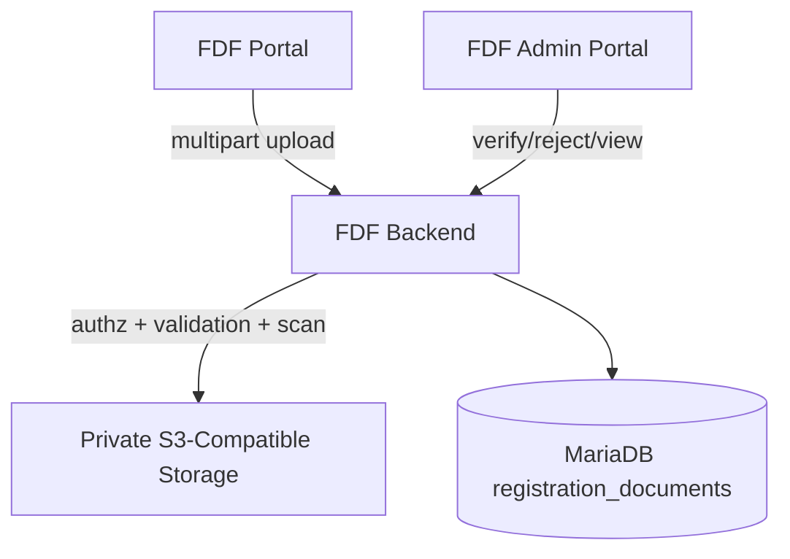

# Phase 7 — Registration Documents & Secure Private Object Storage

## Overview

Director-facing registration document workflow for **Signed Roster** (`SIGNED_ROSTER`) and **Youth Safety Compliance** (`YOUTH_SAFETY`), backed by private S3-compatible object storage with backend-authorized streaming.

## Document Types

| Type | Label | Format |
|------|-------|--------|
| `SIGNED_ROSTER` | Signed Roster | PDF only |
| `YOUTH_SAFETY` | Youth Safety Compliance | PDF only |

## Roles & Access

| Role | Metadata | Content | Upload/Replace | Verify/Reject |
|------|----------|---------|--------------|---------------|
| Director (owner) | Yes | Yes | Conditional | No |
| Director (non-owner) | No | No | No | No |
| Registration Admin | Yes | Yes | Yes (admin) | Yes |
| Global Admin | Yes | Yes | Yes (admin) | Yes |
| Competitions Admin | No | No | No | No |
| Judge Admin | No | No | No | No |
| Viewer | No | No | No | No |
| Judge | No | No | No | No |

## Lifecycle

```
Director uploads → PENDING → Admin verifies → VERIFIED (Director locked)
                           → Admin rejects → REJECTED → Director replaces → PENDING
```

- Each replacement creates a **new version**; old versions remain in history (`is_current = 0`).
- Storage objects are **immutable** — each version gets a unique opaque `storage_key`.
- `storage_key` is never exposed to clients and is not an authorization token.

## Storage Architecture



**Retrieval:** User → Backend authorization → private storage stream → User

**Decision:** Backend-authorized streaming (not permanent presigned URLs) for sensitive PII documents.

## Environment Variables

```env
DOCUMENT_STORAGE_PROVIDER=s3|local|test
DOCUMENT_STORAGE_BUCKET=
DOCUMENT_STORAGE_REGION=
DOCUMENT_STORAGE_ENDPOINT=
DOCUMENT_STORAGE_ACCESS_KEY_ID=
DOCUMENT_STORAGE_SECRET_ACCESS_KEY=
DOCUMENT_STORAGE_FORCE_PATH_STYLE=true
DOCUMENT_MAX_BYTES=10485760
DOCUMENT_SECURITY_SCANNER=clamav|test
CLAMAV_HOST=127.0.0.1
CLAMAV_PORT=3310
```

- **Production:** `DOCUMENT_STORAGE_PROVIDER=s3` required; local disk forbidden.
- **E2E:** `test` provider + `test` scanner (no real credentials).
- **Development:** `local` provider permitted when `NODE_ENV !== production`.

## File Security

- PDF only (`application/pdf` + magic-byte validation)
- Max size: configurable (default 10 MB)
- SHA-256 checksum stored per version
- Malware scan before acceptance (fail-closed in production)
- `X-Content-Type-Options: nosniff`
- `Cache-Control: private, no-store`
- Filename sanitization for display and Content-Disposition

## Deadlines

Uses `event_registration_deadlines` with `submission_type = DOCUMENT`.

- Effective cutoff: deadline date + 1 day at 05:00 (event timezone)
- Directors blocked after cutoff; admins retain override
- Verified lock takes precedence over open deadline
- Historical events: read-only

## API Endpoints

| Method | Path | Description |
|--------|------|-------------|
| GET | `/portal/groups/:id/document-context` | Director context |
| GET | `/groups/:groupId/documents` | Current documents |
| GET | `/groups/:groupId/documents/history` | Version history |
| POST | `/groups/:groupId/documents` | Upload/replace |
| GET | `/groups/:groupId/documents/:id/content` | Authorized stream |
| PATCH | `/groups/:groupId/documents/:id/verify` | Admin verify |
| PATCH | `/groups/:groupId/documents/:id/reject` | Admin reject |

## Production Deployment Checklist

- [ ] Private bucket created
- [ ] Public/anonymous access disabled
- [ ] App credentials created with least privilege (PutObject, GetObject, HeadObject)
- [ ] Server-side encryption configured
- [ ] Application env configured (`DOCUMENT_STORAGE_PROVIDER=s3`)
- [ ] Malware scanner configured (`DOCUMENT_SECURITY_SCANNER=clamav`)
- [ ] Test upload successful
- [ ] Anonymous GET denied
- [ ] Authorized Director GET works
- [ ] Unauthorized Director GET denied
- [ ] Admin GET works
- [ ] Backups/retention reviewed

## Production Blockers (Infrastructure)

- Production private object-storage bucket/credentials must be provisioned
- Production malware scanner must be provisioned (ClamAV or equivalent)
- PRODUCTION DB CREDENTIAL ROTATION REQUIRED (unrelated carry-forward)
- Google Sign-In real-provider staging validation required
- Authoritative FDF musician list required
